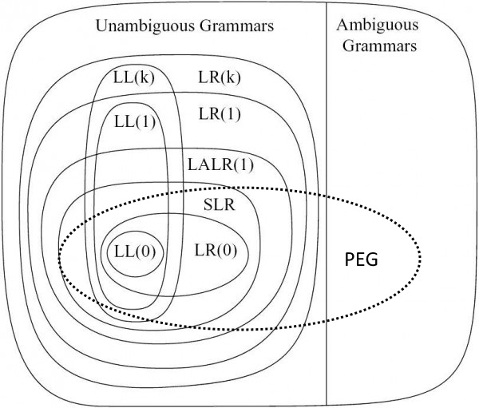

<div style="text-align: center; position: relative">
  <h1>Parser-Crashkurs</h1>
  <table style="margin: 0 auto">
    <tr>
      <td></td>
      <td>
        Markus Rudolph<br/>
        <span style="vertical-align: middle">
        <strong>/ Lotes</strong>
        </span>
      </td>
    </tr>
  </table>
</div>

---

# Motivation

* Verwendung von komplexen strukturierten Daten
* Erstellen eigener menschenlesbarer Datenformate
* Formulieren von Sachverhalt in der Domäne des Sachverhaltes (domänenspezifische Sprachen wie CSS)
* Angst nehmen Sprachen zu entwickeln

<div style="color: gray; position: absolute; bottom: 1em; right: 1em; left: 1em">
  Diese Präsentation wurde mittels Markdown-, GraphViz-, CSS- und EBNF-Sprachen realisiert. Änderungen konnten deswegen automatisiert umgesetzt werden.
</div>
---

# Abgrenzung

* keine vollständigen Compiler, nur Parser
* Literatur:

<div>
<table>
<tr>
<td>
<a href="https://www.amazon.de/Compilers-Alfred-V-Aho/dp/0201100886/ref=sr_1_1?ie=UTF8&qid=1528540750&sr=8-1&keywords=aho+compilers">
  
</a>
</td>
<td>
<a href="https://www.amazon.de/Übersetzerbau-Virtuelle-eXamen-press-Reinhard-Wilhelm/dp/3540495967/ref=sr_1_1?ie=UTF8&qid=1528541931&sr=8-1&keywords=übersetzerbau+virtuelle">
  
</a>
</td>
<td>
<a href="https://www.amazon.de/%C3%9Cbersetzerbau-Syntaktische-Semantische-Analyse-eXamen-press/dp/3642011349/ref=sr_1_4?ie=UTF8&qid=1528542111&sr=8-4&keywords=%C3%BCbersetzerbau">
  
</a>
</td>
<td>
<a href="https://www.amazon.de/%C3%9Cbersetzerbau-Analyse-Transformation-eXamen-press-German/dp/3642033296/ref=sr_1_fkmr0_4?s=books&ie=UTF8&qid=1528540678&sr=1-4-fkmr0&keywords=%C3%BCbersetzerbau+objektorientierte"></a>
</td>
</tr>
</table>
</div>
---

# Inhalte


* Parsen mit Generator
  * Grammatik schreiben
  * Grammatikbestandteile
  * Sprachklassen
  * Gängige Probleme
* Parsen ohne Generator

---

# Grammatik schreiben

<table>
<tr>
<td>
  <p>&quot;Mich beliebt es <i>Angular-like</i> HTML-Komponenten mittels Expressions zu definieren. Ich gedenke mir dafür einen Parser zu schreiben. Alle existierenden Lösungen sind Firlefanz!&quot;</p>
  <br/>
  <div style="color: gray; font-size: smaller; font-align: right">- <i>Siegbert von Schnösel</i> -</div>
</td>
<td></td>
</tr>
</table>

---

# Erklärung: Angular Expressions

* einfache Ausdrücke
* wenn sich eine Variable ändert, wird der komplette Ausdruck neu berechnet und die HTML-Komponente aktualisiert

<p style="position: relative; text-align: center;">


</p>

---

# Operationen auf Sprachen

* ein Wort `A` ist eine Abfolge von Buchstaben
* die Konkatenation von Wörtern `A` und `B` ist wieder ein Wort `AB`.
* die endliche Wiederholung eines Wortes `A` ist wieder ein Wort
  * `A*` bedeutet `0` bis `n` mal
  * `A+` bedeutet `1` bis `n` mal
  * `A?` bedeutet `0` oder `1` mal
* Die Vereinigung zweier Wörter `A` und `B` ist wieder ein Wort `A | B` (Alternation).
* keine Sorge, es gibt noch mehr, aber zur weiteren Erklärung reicht das

```ebnf
[aa]* = &epsilon; | aa | aaaa | aaaaaa | ...
```

---

# Backus-Naur-Form

### Grammatikregeln

Eine Regel besteht aus einem Nichtterminal auf der linken Seite und einem Mix von Terminalen und Nichtterminalen auf der rechten Seite. Getrennt durch den `::=`-Operator.

```ebnf
NICHT-TERMINAL-A ::= MIX VON 'terminal' 'und' NICHT-TERMINAL-B
```

### Terminale

Terminale produzieren Buchstaben für die zu bildene Sprache.
Entweder in From von Strings oder in Form von regulären Ausdrücken.

```ebnf
'&&'    //in Form von Text
[0-9]+  //in Form von regulären Ausdrücken
```

---

# Backus-Naur-Form...

### Nichtterminale

Nichtterminale auf der linken Seite einer Regel kann man als Funktionsdefinition ansehen. Nichtterminale auf der rechten Seite sind so etwas wie Funktionsaufrufe innerhalb der Sprache.

```ebnf
NUM ::= DIGIT+
DIGIT ::= '0' | ... | '9'
```

---

# Backus-Naur-Form...

### Pseudoterminale und Rückgabetypen

Pseudoterminale produzieren keine Sprachteile, werden aber ausgeführt wenn der Parser an diesem Teil der Grammatik ankommt.

```ebnf
Num  <int> ::= Num Digit { $$ = $1 * 10 + atoi($2); }
             | Digit     { $$ = atoi($1); }
```

Pseudoterminale sind ein gängiges Vorgehen um abstrakte Syntaxbäume aufzubauen und meistens unvermeidbar. Sie blähen die Grammatik stark auf!

---

# Backus-Naur-Form...

### Plattformspezifische Bestandteile

* Metadaten wie Klassennamen
* Importe von Bilbliotheken oder Headers

Beipiel aus NPegasus:
```ebnf
@namespace MainCore.Common.Comments
@classname CommentLineParser
@using System.Linq;
```

* sonst "syntaktischer Zucker" wie \[Referenzen_in_XText\]
* Prüfungen am Lookahead auch denkbar
* ... das wird jetzt zu speziell

---

# Welches Tool?

Ich benutze `Jison`. NodeJS. Installieren mit `npm i -g jison`.

```jison
//Importe, Tokendefinitionen, Startdefinition, weitere Regeln...
expression      : literal
                | ID args?
                | expression DOT ID args?
                | expression PIPE ID filterArg*
                | expression LBRACKET expression RBRACKET
                | preOp expression
                | expression binOp expression
                | expression QUESTION expression COLON expression
                ;
```

* bauen des Parsers mit `jison input.jison output.js`

---

# Ergebnis

### 1.563 Zeilen an Fehlern

<p style="position: relative; text-align: center;">


</p>

<center><i>"A fool with a tool is still a fool!"</i></center>

---

<div style="margin: 0 auto; text-align: center">
<h3>Wie wäre es mit etwas...</h3>

</div>

---

# Sprackklassen

* Formale Sprachen (Chomsky-Hierarchie)
  * Typ-0-Grammatik: semientscheidbare Sprachen
  * Typ-1-Grammatik: kontextsensitive Sprachen
  * Typ-2-Grammatik: kontextfreie Sprachen
  * Typ-3-Grammatik: reguläre Ausdrücke
  * Typ 3 &#x2282; Typ 2 &#x2282; Typ 1 &#x2282; Typ 0

<div style="position: relative;  text-align: center;">
  
  <div style="width: 100%; position: absolute; text-align: center; z-index: 1000; color: white; bottom: 0px; font-size: 36px; font-weight: bold">
  &quot;Form&quot;-AL
  </div>
</div>

---

# Und es gibt noch...

<table>
<tr>
<td>
<div style="position: relative;  text-align: center;">
  
  <div style="width: 100%; position: absolute; text-align: center; z-index: 1000; color: white; top: 0px; font-size: 36px; font-weight: bold">
  &quot;PEG&quot;
  </div>
</div>
</td>
<td>
<ul>
<li><i><b>P</b>arser <b>E</b>xpression <b>G</b>rammar</i></li>
<li>auch &quot;praktische Grammatik&quot; genannt</li>
<li>implementierbar mittels <i>parser combinators</i></li>
</ul>
</td>
</tr>
</table>

---

# Problem

### Domänspezifische Sprachen <i>sind meistens vom Typ-0 oder Typ-1</i>.

<table style="width:100%">
<tr>
<td>Das heißt: &quot;Im Allgemeinen kann ein Wort der Sprache nicht in effizienter Laufzeit erkannt werden.&quot;</td>
<td>

</td>
</tr>
</table>

---

# Lösung

### Es bleiben uns nur noch Typ-2- und Typ-3-Grammatiken.

<table style="width:100%">
<tr>
<td>
<span style="font-size: 24px">Diese Sprachen sind in <i>polynomieller Laufzeit</i> erkennbar!</span>
</td>
<td>

</td>
</tr>
</table>

<center>Das heißt aber auch, dass nach der Erkennung noch Validierungsarbeit zu leisten ist!</center>

---

# Allgemeiner Verlauf

...für formale Grammatiken:


PEGs dagegen haben __keine__ lexikalische Analyse.

---

# Lexikalische Analyse

<b>Beispiel</b>: `12 * i + 5`

Ein Strom von Charactern


wird zu einen Strom von Tokens


* "Komplexität" 10 zu 5
* Werkzeug dazu: "Lexer" oder "Scanner" oder "Tokenizer"
* Artikel: [Wie schreibt man einen Lexer?](http://blog.lotes-lab.de/how-to-build-a-lexer/)

---

# Syntaktische Analyse

Beispiel


wird zu einem abstrakten Syntaxbaum umgewandelt


---

# Semantische Analyse

* abstrakten Syntaxbaum validieren (`Visitor` pattern!)
* Baum mit neuen Eigenschaften annotieren oder Fehler generieren


---

# Nächste Phasen

Die semantische Phase erfordert Wissen über die Domäne.

Darauffolgende Phasen auch! Darum gibt es hier einen Schnitt!

---

# Kontextfreie Parser

### `LL` und `LR`

  * das erste `L` ist die Leserichtung
  * der zweite Buchstabe sagt: "Ich fange mit der linken (rechten) Seite einer Grammatikregel an."
  * `LL` heißen auch "Top-Down-Parser"
  * `LR` heißen "Bottom-Up-Parser"

---

# Mächtigkeit von `LL`, `LR` und `PEG`

* `LL` ist einfacher nachzubauen, hat aber mehr Einschränkungen
* `LR` gibt es in verschiedenen Schwierigkeitsgeraden
  * `SLR`, `LALR`, `LR(1)`, `LR(0)`, `LR(k)`...
  * Linksfaktoren und Linksrekursionen möglich

<div style="text-align: center">
  
</div>

---

# `LL`-Parser, kurz und gut

<div style="position: relative">
  
  
</div>

---

# `LR`-Parser, kurz und gut


---

# `LR`-Parser in Aktion


---

# Nur 4 Regeln!

<div style="text-align: center">
  
</div>

---

# Mehrdeutigkeiten verstehen

```ebnf
Stmt ::= 'if' Expr 'then' Stmt 'else' Stmt
      | 'if' Expr 'then' Stmt
```

Mögliche Syntaxbäume für

```
if condition then if(condition2)
then A else B
```

<center>

</center>

---

# Vorrangregeln umsetzen

Folgende Grammatik ist mehrdeutig. Durch Umssetzen von Vorrangregeln mittels <i>Operator-Kaskade</i> oder <i>Operator-Deklaration</i>.

```ebnf
E ::= E '*' E
   |  E '+' E
   |  NUM
   |  E '++'
   |  '(' E ')'
```

Dabei liegen die stärker bindenen Operatoren näher an der Low-Level-Regel `F` und lockere Operatoren näher an der High-Level-Regel `E`.

```ebnf
E ::= T '+' E
   |  T
T ::= F '*' T
   |  F
F ::= F '++'
   |  NUM
   | '(' E ')'
```

`LR`-Parser sind ab jetzt schon zufrieden. `LL`-Parser ist unschlüssig, weil `E` zwei Alternativen hat, die mit `T` anfangen.

---

# Linksfaktoren eliminieren

`LL`-Parser streikt, da Linksfaktoren mehrdeutige Einträge in der Parsingtabelle eintragen würde.

```ebnf
E ::= T '+' E
   |  T
T ::= F '*' T
   |  F
F ::= F '++'
   |  NUM
   | '(' E ')'
```

Lösung: Faktoren rausziehen und einzeln aufführen.

```ebnf
E  ::= T E'
E' ::= '+' T E'
    |  &epsilon;
T  ::= F T'
T' ::= '*' F T'
    |  &epsilon;
F  ::= F '++'
    |  NUM
    |  '(' E ')'
```

`LL`-Parser beschwert sich jetzt noch über die Linksrekursion in `F`.

---

# Linksrekursionen ersetzen

Linksrekursionen würden den Parser in eine Endlosschleife schicken.

```ebnf
F  ::= F '++'
    |  NUM
    |  '(' E ')'
```

Die folgende Transformation löst die Rekursion auf!

```ebnf
F  ::= NUM F'
    |  '(' E ')' F'
F' ::= '++'
    |  &epsilon;
```

---

### Noch nicht ganz fertig!

Manche Generatoren (wie `jison`) mögen keine mit `*` oder `+` definierten Listen.

```ebnf
FunctionCall ::= Id '(' Arguments? ')'
Arguments    ::= Argument (',' Argument)*
```

---

# Listen ausbauen

Hier muss man die Iteration durch eine Rekursion ersetzen!

```ebnf
FunctionCall ::= Id '(' Arguments? ')'
Arguments    ::= Argument (',' Argument)*
```

wird also zu:

```ebnf
FunctionCall ::= Id '(' ArgumentList ')'
ArgumentList ::= Arguments
              |  &epsilon;
Arguments    ::= Argument Arguments'
Arguments'   ::= &epsilon;
              | ',' Arguments
```

---

# Assoziativität

Links oder rechts? Verdammt wichtig bei nicht-assoziativen Operatoren!

### Beispiel: Subtraktion mit `-`!

Was ist der Syntaxbaum zu `10 - 20 - 30 - 40`?

---

<table width="100%">
<tr>
<td>
<h3>Linksassoziativität</h3>
</td>
<td>
<h3>Rechtsassoziativität</h3>
</td>
</tr>


<tr>
<td>

</td>
<td>

</td>
</tr>

<tr>
<td>

<code>
SUB ::= SUB '-' NUM
    |  NUM
</code>

</td>
<td>

<code>
SUB ::= NUM '-' SUB
    |  NUM
</code>

</td>
</tr>


<tr>
<td>
Linksrekursion auflösen wie vorhin gezeigt.
</td>
<td>
Linksfaktor eliminieren wie vorhin gezeigt.
</td>
</tr>
</table>

---

<center>
  <h1>Manuelles Parsen</h1>
  <h3>Zwei Wege</h3>

  <p style="position: relative;">
    
    <div style="position: absolute; left: 0px; z-index: 1000; color: white; bottom: 0px; font-size: 36px; font-weight: bold">
    Rekursiver Abstieg
    </div>
  </p>
</center>

---

# Parsen mittels Rekursion

Zum Beispiel:

```ebnf
Expr ::= Term '+' Expr | Term
Term ::= Primary '*' Term | Primary
Primary ::= NUMBER | '(' Expr  ')'
```

Man benötigt hierfür eine `LL`-Grammatik!

---

# Parsen mittels Rekursion

Implementierung: Jede Grammatikregel eine Funktion!

```ebnf
Expr ::= Term '+' Expr | Term
```

wird zu

```csharp
ExpressionNode Expression() {
  var left = Term();
  if(TryConsume(PLUS)) {
    var right = Expr();
    return new BinaryExprNode(ADD, left, right);
  } else {
    return left;
  }
}
```

---

# Parsen mittels Rekursion

```ebnf
Term ::= Primary '*' Term | Primary
```

wird zu

```csharp
ExpressionNode Term() {
  var left = Primary();
  if(TryConsume(MUL)) { //lookahead
    var right = Term();
    return new BinaryExprNode(MULTIPLY, left, right);
  } else {
    return left;
  }
}
```

---

# Parsen mittels Rekursion

```ebnf
Primary ::= NUMBER | '(' Expr  ')'
```

wird zu

```csharp
ExpressionNode Primary() {
  var left = Primary();
  switch(lookahead.Type) {
    case NUMBER:
      var result = new NumberLiteral(Convert.ToInt32(lookahead.Text)));
      lookahead++;
      return result;
    case LPARENTHESIS:
      lookahead++;
      var result = Expr();
      Consume(RPARENTHESIS); //throws exception, if not exists
      return result;
  }
  throw new Exception("No match, NUMBER OR '(' expected!");
}
```

---

# Parsen mittels Kombinatoren

Im Prinzip genau das selbe! Nur in Funktionen versteckt.

Grundlegende Operationen auf <i>praktischen</i> Sprachen sind:

* Konsumierung von Buchstaben `'hallo'` (bilden ein <i>Wort</i>)
* Konkatenierung von Wörtern `AB`
* endliche Wiederholung von Wörtern `A*`
* <u>priorisierte</u> Alternativen von Wörtern `A / B / C` (Patternmatching oder `switch`-Anweisung)

---

# Parsen mittels Kombinatoren

Beispiel für die Erkennung von Zahlen:

```csharp
Start = Code(OneOrMore(Digit), text => Convert.ToInt32(text));
Digit = Or(Char('0'), Char('1'), ... Char('8'), Char('9'));

Assert.AreEqual(123, Start.Parse("123"));

Start.Parse("abc"); //throws exception
```

---

TODO https://github.com/otac0n/Pegasus/tree/develop/Pegasus/

---

# Abschließende Worte

* Parser mittels Generatoren zu schreiben ist einfach
* manuell zu schreiben ist unnötige sich wiederholende Arbeit (hat aber auch etwas meditatives xD...)
* empfohlenes Vorgehen:
  * Grammatik und Grammatiktests ausschreiben
  * Syntaxbaum generieren lassen
  * Syntaxbaum validieren
  * aus dem Baum das Endartefakt generieren

---

<div style="text-align: center">
<h1>Danke für die Aufmerksamkeit!</h1>

<h3>Happy hacking!</h3>
</div>
