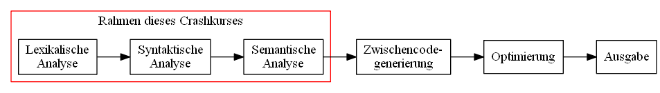
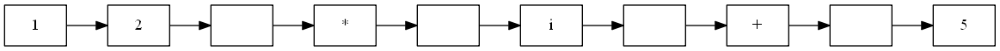
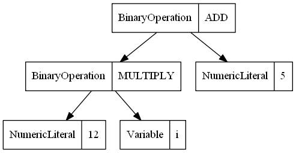

# Parser-Crashkurs

---

# Motivation

* Verwendung von komplexen strukturierten Daten
* Erstellen eigener menschenlesbarer Datenformate
* Formulieren von Sachverhalt in der Domäne des Sachverhaltes (domänenspezifische Sprachen wie CSS)
* Angst nehmen vor Sprachen zu entwickeln (Aufwand Parserentwicklung?)
* Aufzeigen von Aufwänden nach dem Parsen

---

# Abgrenzung

* keine vollständigen Compiler, nur Parser
* Literatur:

<div>
<table>
<tr>
<td>
<a href="https://www.amazon.de/Compilers-Alfred-V-Aho/dp/0201100886/ref=sr_1_1?ie=UTF8&qid=1528540750&sr=8-1&keywords=aho+compilers">
  
</a>
</td>
<td>
<a href="https://www.amazon.de/Übersetzerbau-Virtuelle-eXamen-press-Reinhard-Wilhelm/dp/3540495967/ref=sr_1_1?ie=UTF8&qid=1528541931&sr=8-1&keywords=übersetzerbau+virtuelle">
  
</a>
</td>
<td>
<a href="https://www.amazon.de/%C3%9Cbersetzerbau-Syntaktische-Semantische-Analyse-eXamen-press/dp/3642011349/ref=sr_1_4?ie=UTF8&qid=1528542111&sr=8-4&keywords=%C3%BCbersetzerbau">
  
</a>
</td>
<td>
<a href="https://www.amazon.de/%C3%9Cbersetzerbau-Analyse-Transformation-eXamen-press-German/dp/3642033296/ref=sr_1_fkmr0_4?s=books&ie=UTF8&qid=1528540678&sr=1-4-fkmr0&keywords=%C3%BCbersetzerbau+objektorientierte"></a>
</td>
</tr>
</table>
</div>
---

# Inhalte

* Grammatik schreiben
* Grammatikbestandteile
* Sprachklassen
* Gängige Probleme
* Parsen ohne Generator

---

# Grammatik schreiben

<table>
<tr>
<td>
  <p>&quot;Mich beliebt es <i>Angular-like</i> HTML-Komponenten mittels Expressions zu definieren. Ich gedenke mir dafür einen Parser zu schreiben. Alle existierenden Lösungen sind Firlefanz!&quot;</p>
  
</td>
<td></td>
</tr>
</table>

---
# Erklärung: Angular Expressions

* einfache Ausdrücke
* wenn sich eine Variable ändert, wird der komplette Ausdruck neu berechnet und die HTML-Komponente aktualisiert

<p style="position: relative; text-align: center;">


</p>
---

# Zurück zum Thema: Grammatik

Erstmal am Beispiel arithmetischer Ausdrücke...

```
Expr  ::= Expr '+' Expr
        | Expr '*' Expr
        | Num
Num   ::= Num Digit | Digit
Digit ::= '0' | '1' ... '9'
```

Backus-Naur-Form!

Terminal? Nichtterminal? Regel? Start?

---

# Grammatik: Weitere Bestandteile

* Pseudoterminale, Codeblöcke und Rückgabetypen

Beispiel:
```
Num <int>
	::= Num Digit
	    { $$ = $1 * 10 + $2; }
```

* Gängiges Vorgehen, ggf. unvermeidbar!
* Bläht die Grammatik auf!

---

# Grammatik: Weitere Bestandteile

* Metadaten
* Importe

Beipiel aus NPegasus:
```
@namespace MainCore.Common.Comments
@classname CommentLineParser
@using System.Linq;
```

---

# Grammatik: Weitere Bestandteile

* sonst "syntaktischer Zucker" wie \[Referenzen_in_XText\]
* Prüfungen am Lookahead auch denkbar
* ... das wird jetzt zu speziell

---

# Ausgangsgrammatik... Welches Tool?

Ich benutze `Jison`. NodeJS. Installieren mit `npm i -g jison`.

```jison
//Importe, Tokendefinitionen, Startdefinition, weitere Regeln...
expression      : literal
                | ID args?
                | expression DOT ID args?
                | expression PIPE ID filterArg*
                | expression LBRACKET expression RBRACKET
                | preOp expression
                | expression binOp expression
                | expression QUESTION expression COLON expression
                ;
```

* bauen des Parsers mit `jison input.jison output.js`

---

# Ergebnis

### 1.563 Zeilen an Fehlern

<p style="position: relative; text-align: center;">


</p>

<center><i>"A fool with a tool is still a fool!"</i></center>

---


<div style="margin: 0; text-align: center">
<h3>Wie wäre es mit etwas...</h3>

</div>

---

# Sprackklassen

* Formale Sprachen (Chomsky-Hierarchie)
  * Typ-0-Grammatik: semientscheidbare Sprachen (unbeschränkt)
  * Typ-1-Grammatik: kontextsensitive Sprachen (`2^O(n)`)
  * Typ-2-Grammatik: kontextfreie Sprachen (`O(n^3)`)
  * Typ-3-Grammatik: reguläre Ausdrücke (`O(n)`)
  * Typ 3 &#x2282; Typ 2 &#x2282; Typ 1 &#x2282; Typ 0

<div style="position: relative;  text-align: center;">
  
  <div style="width: 100%; position: absolute; text-align: center; z-index: 1000; color: white; bottom: 0px; font-size: 36px; font-weight: bold">
  &quot;Form&quot;-AL
  </div>
</div>

---

# Und es gibt noch...

<table>
<tr>
<td>
<div style="position: relative;  text-align: center;">
  
  <div style="width: 100%; position: absolute; text-align: center; z-index: 1000; color: white; top: 0px; font-size: 36px; font-weight: bold">
  &quot;PEG&quot;
  </div>
</div>
</td>
<td>
<ul>
<li><i><b>P</b>arser <b>E</b>xpression <b>G</b>rammar</i></li>
<li>auch &quot;praktische Grammatik&quot; genannt</li>
<li>implementierbar mittels <i>parser combinators</i></li>
</ul>
</td>
</tr>
</table>

---

# Unterschiede

<table style="margin: 0">
<tr>
<td></td>
<td>FormAL</td>
<td>PEG</td>
</tr>
<tr>
<td>bekannt seit</td>
<td>ca. 1970</td>
<td>2004</td>
</tr>
<tr>
<td>Eingabe</td>
<td>Token</td>
<td>Character</td>
</tr>
<tr>
<td>Laufzeit</td>
<td>???</td>
<td>???</td>
</tr>
<tr>
<td>Speicherverbrauch</td>
<td>???</td>
<td>???</td>
</tr>
</table>

---

# Moment! Was sind Tokens?

* werden nur beim **formalen Ansatz** gebraucht!
* beliebter Ansatz: wandle den Strom an Characters um
* ... in einen Strom von "Tokens" (Vorklassifizierung)
* diese werden durch reguläre Ausdrücke beschrieben
* Beispiel für Hexzahlen:

```bnf
HEX_NUMBER ::= [0-9a-fA-F]+
```


---

# Allgemeiner Verlauf

...für formale Grammatiken:


PEGs dagegen haben __keine__ lexikalische Analyse.

---

# Lexikalische Analyse

<b>Beispiel</b>: `12 * i + 5`

Ein Strom von Charactern


wird zu


* "Komplexität" 10 zu 5
* Werkzeug dazu: "Lexer" oder "Scanner" oder "Tokenizer"
* Artikel: [Wie schreibt man einen Lexer?](http://blog.lotes-lab.de/how-to-build-a-lexer/)

---

# Syntaktische Analyse

Beispiel


wird zu einem abstrakten Syntaxbaum umgewandelt



---

# Semantische Analyse

* abstrakten Syntaxbaum validieren (`Visitor` pattern!)
* Baum mit neuen Eigenschaften annotieren oder Fehler generieren


---

# Nächste Phasen

Die semantische Phase erfordert Wissen über die Domäne.

Darauffolgende Phasen auch! Darum gibt es hier einen Schnitt!

---

# Problem

### Domänspezifische Sprachen <i>sind meistens vom Typ-0 oder Typ-1</i>.

<table style="width:100%">
<tr>
<td>Das heißt: &quot;Im Allgemeinen kann ein Wort der Sprache nicht in effizienter Laufzeit erkannt werden.&quot;</td>
<td>

</td>
</tr>
</table>

---

# Lösung

### Es bleiben uns nur noch Typ-2- und Typ-3-Grammatiken.

<table style="width:100%">
<tr>
<td>
Diese Sprachen sind in polynomieller Laufzeit erkennbar!
</td>
<td>

</td>
</tr>
</table>

# Typ-2: Kontextfreie Grammatiken

* erkennbar mit CYK-Algorithmus in `O(n^3)` mittels dynamischer Programmierung
* besser mittels LL(?)- und LR(?)-Parser
  * das erste 'L' ist die Leserichtung
  * der zweite Buchstabe sagt: "Ich fange mit der linken (rechten) Seite einer Grammatikregel an."
  * das `?` steht für die Größe des Lookaheads

---

# Typ-3: Reguläre Ausdrücke

---

TODO

* Parsergeneratoren LL/LR erklären
  * LL(1)
    * FIRST-Mengen, Follow-Mengen
    * Parsertabelle
* Unterschiede/Gemeinsamkeiten
* Fehlerbehandlung/Autocompletion
* AST abwandern: Validierung, Generierung
---

---

# Gängige Probleme

TODO

* Mehrdeutigkeiten beseitigen!
  * if-then-else: Dangling else
* shift/reduce nachgucken
* Operatorvorangregeln
* Linksfaktorisierung
* Linksrekursion
* Listenausdrücke
* Operatorenassoziativität

---

# Parser ohne Generator

* zwei Wege
  * in LL-Manier rekursiv absteigen
  * Parser-Kombinatoren

---

# Parsen mittels Rekursion

* Voraussetzung: LL(1)-Grammatik liegt vor
  * keine Mehrdeutigkeiten
  * keine Linksrekursionen
  * keine Linksfaktorisierungen

---

# Parsen mittels Rekursion

Zum Beispiel:

```ebnf
Expr ::= Term '+' Expr | Term
Term ::= Primary '*' Term | Term
Primary ::= NUMBER | '(' Expr  ')'
```

---

# Parsen mittels Rekursion

Implementierung: Jede Regel eine Funktion!

```ebnf
Expr ::= Term '+' Expr | Term
```

wird zu

```csharp
ExpressionNode Expression() {
  var left = Term();
  if(TryConsume(PLUS)) {

    /*if(lookahead.type==PLUS) {
      lookahead++; return true; }
      else return false; */

    var right = Expr();
    return new BinaryExprNode(ADD, left, right);
  } else {
    return left;
  }
}
```

---

# Parsen mittels Rekursion

```ebnf
Term ::= Primary '*' Term | Term
```

wird zu

```csharp
ExpressionNode Term() {
  var left = Primary();
  if(TryConsume(MUL)) { //lookahead
    var right = Term();
    return new BinaryExprNode(MULTIPLY, left, right);
  } else {
    return left;
  }
}
```

---

# Parsen mittels Rekursion

```ebnf
Primary ::= NUMBER | '(' Expr  ')'
```

wird zu

```csharp
ExpressionNode Primary() {
  var left = Primary();
  switch(lookahead.Type) {
    case NUMBER:
      var result = new NumberLiteral(Convert.ToInt32(lookahead.Text)));
      lookahead++;
      return result;
    case LPARENTHESIS:
      NextToken();
      var result = Expr();
      Consume(RPARENTHESIS); //throws exception, if not exists
      return result;
  }
  throw new Exception("No match, NUMBER OR '(' expected!");
}
```

---

# Parsen mittels Kombinatoren

Im Prinzip genau das selbe! Nur in Funktionen versteckt.

Grundlegende Operationen auf <i>praktischen</i> Sprachen sind:

* Konsumierung von Buchstaben `'hallo'` (bilden ein <i>Wort</i>)
* Konkatenierung von Wörtern `AB`
* endliche Wiederholung von Wörtern `A*`
* <u>priorisierte</u> Alternativen von Wörtern `A / B / C` (Patternmatching oder `switch`-Anweisung)

---

# Parsen mittels Kombinatoren

Beispiel: ein Wort konsumieren

```csharp
bool TryConsume(ref int position, string text) {
  if(input.At(position).startsWith(text)) {
    position += text.Length;
    return true;
  } else
    return false;
}
```

Konkatenation:

```csharp
bool
```

---
